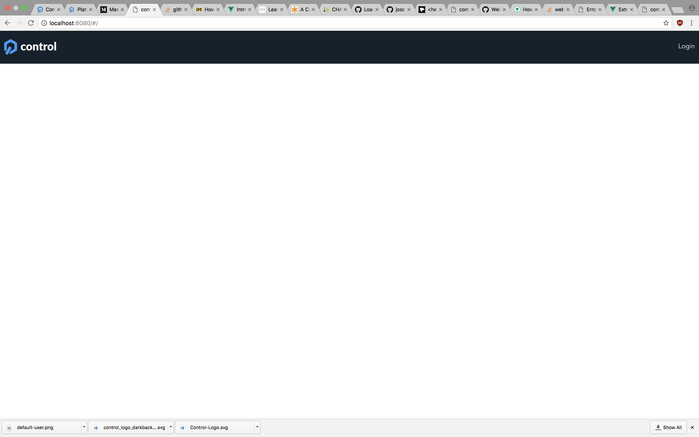

# Goal for Day 1 : Oct 5

- [] Get familiar with essentials of Vue.js and the scaffolding
    - [x] Using single file components
- [x] Identify all the "pages" that are needed for the app
    - Login
    - ToDo ( Home ) - make the automatically redirect to login screen if the user is not logged in
    - Master Page ( App.vue )
- [x] Set up routing/components for the pages
- [] Set up master page with top "nav" bar( layout/style )
    - [x] Create TopNav component
        - [] set up html/css layout
        - [] add "Logged in user" widget component

    

# Nice to have

- [x] use LESS ( https://tutorialzine.com/2015/07/learn-less-in-10-minutes-or-less )
    - [] set up library of less variables : Right now, I cannot share css variables defined in lib.less file in vue components, even though I import the lib file.  For SASS, there seems to be sass-resource-loader plugin for this purpose. Need to find how to do ths with LESS
- [x] I really need syntax highlighiting for .vue files!!
- [x] integrate ESlint with IDE ( VSCODE )
- ESLint
    - [x] disable indent check in eslint
    - [x] change base from standard to recommended configuration

# Questions/Thoughts that comes to mind

- What is the best way to organize css in Vue.js SPA project?
- Is there a centralized state object shared or are the states held per component ViewModel?  -> need to see more examples SPA built with SPA
    - official guid on how to build large scale app ( v1 though ) https://v1.vuejs.org/guide/application.html
- First time using eslint where it is a dependency on build process; indent errors preventing build proved be an obstacle ( now resolved ).

# Long term goals ( so that I do not forget )

- Set up deployment to ( heroku/github or anywhere that can be publically accessed )
- Responsive layout ( nice to have )
- unit/e2e testing 
- undo/redo ( nice to have, probably should choose between testing or undo/redo )

# Retrospective 

- Not being a dedicated front-end dev, I do not know what is the best-practice when constructing html+css layouts;  Not sure what tags to pick, what nesting structures are ideal to build layout such as the top nav bar.
- Some shops require that designers generate html+css when other do not.  Would this be the responsiblith of front-end developer?

# Progress So Far :

